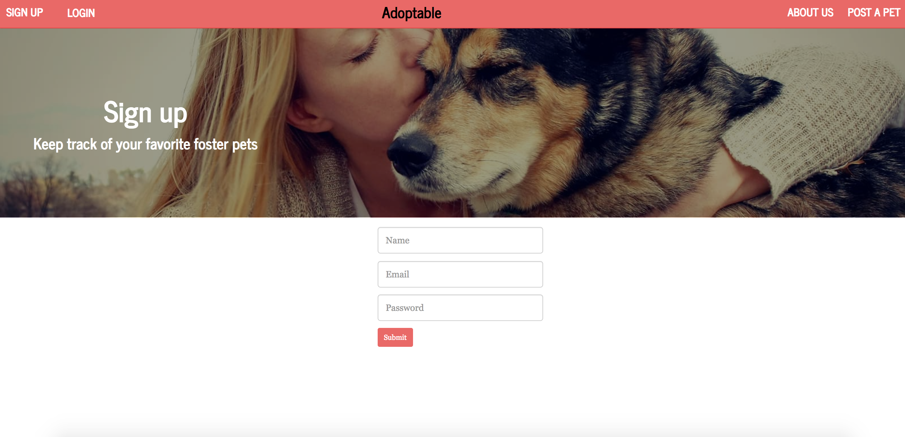
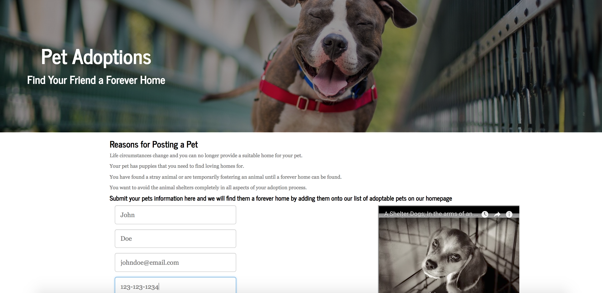
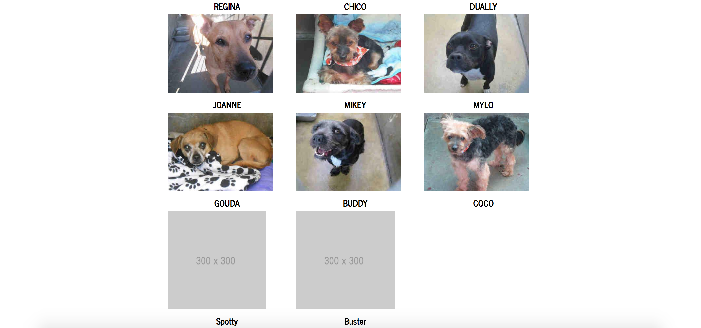
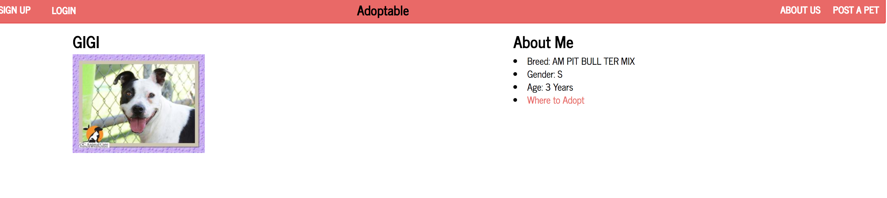
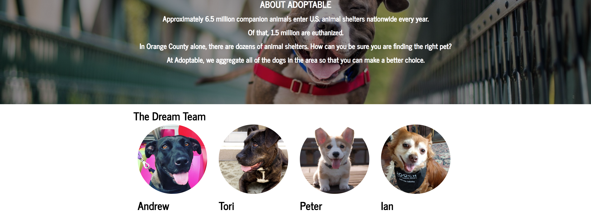

# Adoptable

Welcome to Adoptable

A web based application that aggregates all the local shelter animals into one centralized location to make the process of searching for a pet easier and at the same time promoting adoption from shelters to reduce the amount of animlas that are euthanized annually.

This application also allows users to "post" animals into our database so that in the event they have an animal that they need to give away, they have a platform to communicate with other users that are actively searching for pets. This provides another option for pet owners to find their animals loving homes without the need for giving their pets to animal shelters. 

Technology used:

- MERN Stack
- NodeJS and Express Server
- Mongo database with Mongoose ORM
- ReactJS, CSS, Bootstrap
- Web Scrape
- User authentication and verification for application log in
- MVC Interface
- API Data Routing

Sign Up Page and Login.
 

Main Home Page with aggregated list of shelter animals all centrally located.
 

Posting a Pet.
 

Posted Pet is added to homepage with all animals that need adoption.
 

Pet Profile Page where can get more information about a particular pet.
 

About Adoptable and meet the team that made it happen.
 

 
